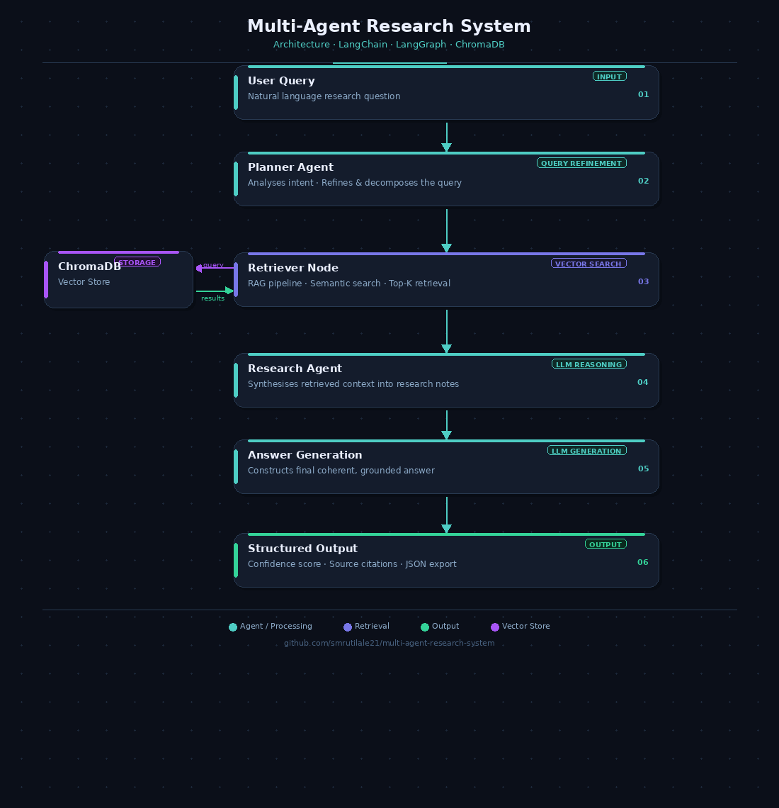
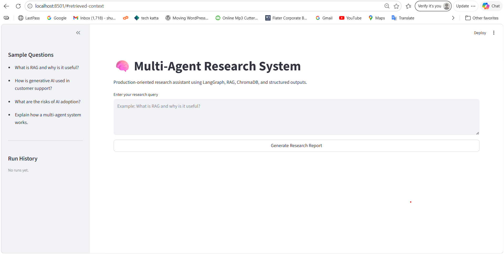
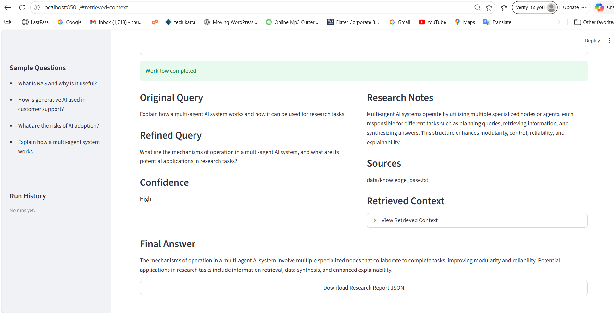
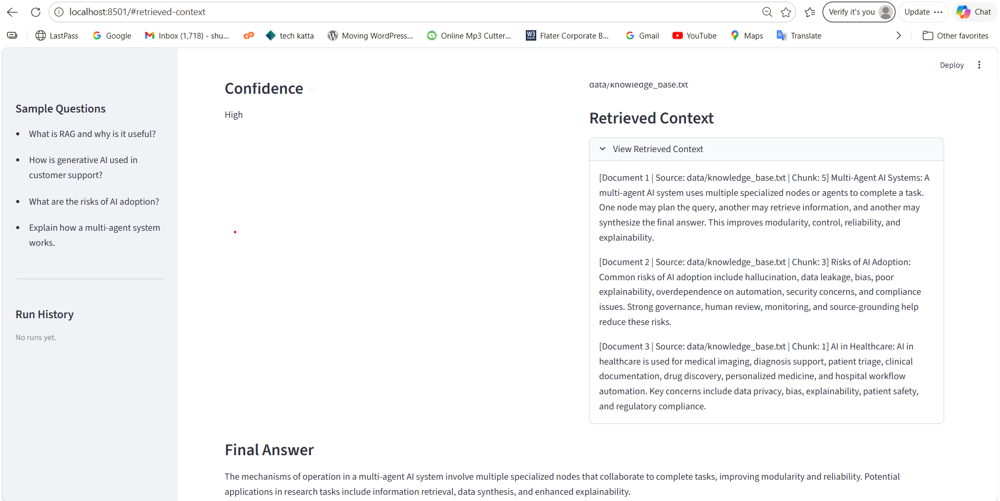
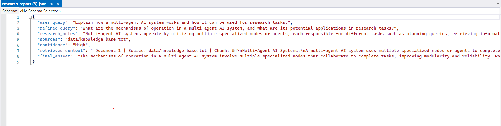
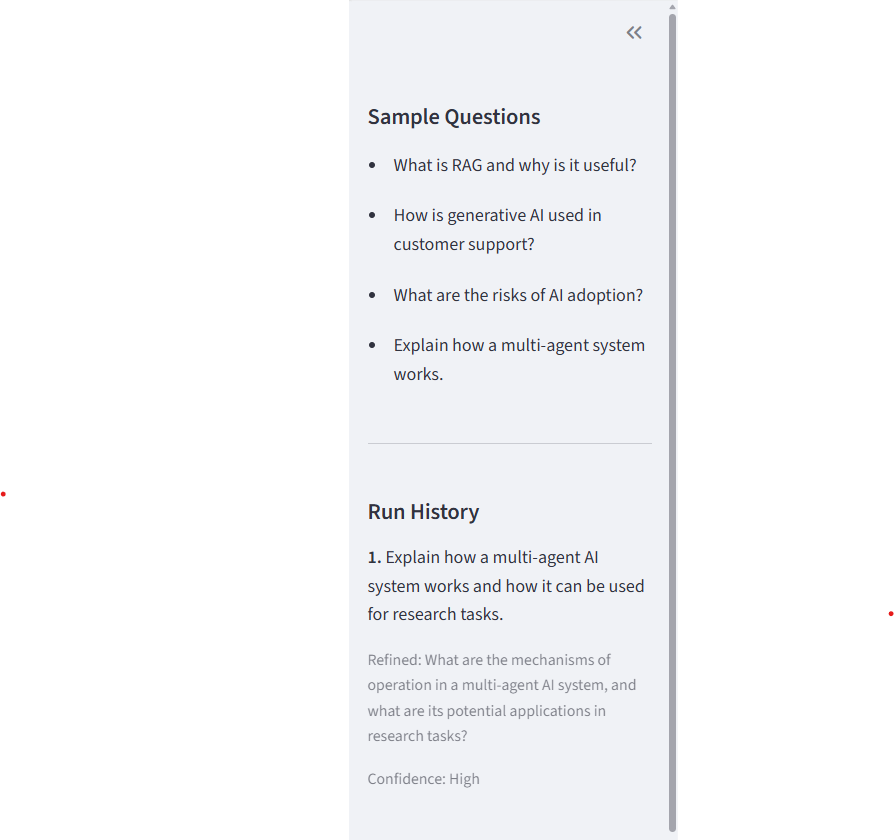

# 🧠 Multi-Agent Research System (LangGraph + RAG + ChromaDB)

A production-oriented multi-agent AI system that performs intelligent research using a structured workflow and Retrieval-Augmented Generation (RAG), delivering context-aware and reliable responses.

---

## 🏗️ Architecture Diagram (with image)

```text
User Query
    ↓
Planner Agent (Query Refinement)
    ↓
Retriever (RAG using ChromaDB → Retrieved Context)
    ↓
Research Agent (Generates Research Notes)
    ↓
Response Generator (Final Response)
    ↓
Structured Output (Confidence + Sources + JSON Export)
```



---

## 🔄 Workflow

1. User submits a query through the Streamlit interface
2. Planner agent refines the query for better retrieval
3. Retriever fetches relevant context from ChromaDB using embeddings
4. Research agent analyzes the context and generates structured notes
5. Final response is synthesized based on retrieved knowledge
6. System outputs confidence score, sources, and downloadable JSON report

---

## 🧠 System Design Insight

This system is designed as a modular multi-agent architecture to enable scalable and reliable intelligent research workflows using LLMs and Retrieval-Augmented Generation (RAG).

The architecture separates responsibilities across specialized agents to improve clarity, maintainability, and extensibility:

- Planner Agent → Refines and structures the user query for better downstream processing
- Retriever Agent → Performs semantic retrieval using embeddings over a persistent ChromaDB vector store
- Research Agent → Synthesizes retrieved context into structured insights and research notes
- Response Generator → Produces the final structured response with confidence score and sources

This separation of concerns ensures that each component operates independently, making the system easier to debug, scale, and improve over time.

The system also incorporates production-oriented considerations such as:

Structured output validation using Pydantic
Retry mechanisms for handling LLM inconsistencies
Logging for observability and debugging
Modular design for easy extension of agents or workflows

Overall, the architecture demonstrates how multi-agent systems can be used to build reliable, production-style AI applications that go beyond simple prompt-based LLM applications.

---

## Live Demo
[Open App](https://agentic-research-system-21.streamlit.app)

---

## 🧠 Key Features

* Multi-agent workflow using LangGraph
* RAG pipeline with ChromaDB (persistent vector database)
* OpenAI embeddings for semantic search
* Structured output validation using Pydantic
* Retry mechanism for handling invalid or malformed LLM outputs
* Logging for observability and debugging
* JSON export of results
* Modular and scalable architecture

---

## 🌟 Highlights

* Designed a multi-agent AI system using LangGraph with modular agents, observability, and structured output validation
* Implemented RAG pipeline with persistent ChromaDB
* Built structured output system with validation and retries
* Developed an end-to-end Streamlit application for research automation

---

## 🛠️ Tech Stack

* Python
* LangGraph
* LangChain
* ChromaDB
* OpenAI API
* Pydantic
* Streamlit

---

## 🧪 Example Queries

* What is RAG and how does it improve LLM performance?
* Explain how a multi-agent AI system works
* What are the risks of AI adoption in enterprises?
* How is generative AI used in customer support?

---

## 🧪 Example Output

**Query:** What is RAG?

**Answer:**
Retrieval-Augmented Generation (RAG) enhances LLM responses by retrieving relevant context from external knowledge sources 
before generating answers, improving accuracy and grounding.

**Confidence:** 0.92

**Sources:**

* Document 1
* Document 2

---

## 📸 Demo Screenshots

### 🏠 Home Screen



### 🔍 Sample Query & Output



### 📚 Retrieved Context (RAG)



### 📄 JSON Export



### 🕘 Run History



---

## ⚙️ Setup Instructions

```bash
git clone https://github.com/smrutilale21/multi-agent-research-system.git
cd multiAgent-system
pip install -r requirements.txt
```

---

## 🔐 Environment Setup

Create a `.env` file in the root directory:

```env
OPENAI_API_KEY=your_api_key_here
OPENAI_MODEL=gpt-4o-mini
```

---

## ▶️ Run the Application

```bash
streamlit run app.py
```

---

## ⚠️ Notes

* ChromaDB files are excluded via `.gitignore`
* `.env` is not committed for security reasons
* Logs are stored locally for debugging purposes

---

## 🔮 Future Improvements

* Add hybrid retrieval (ChromaDB + web search)
* Improve chunking strategy for better retrieval accuracy
* Add evaluation metrics for retrieval quality
* Introduce memory for conversational context

---

## 📌 Conclusion

This project demonstrates a real-world implementation of a multi-agent AI system using RAG, structured outputs, and modular architecture — showcasing strong understanding of scalable, production-ready AI system design.

---
